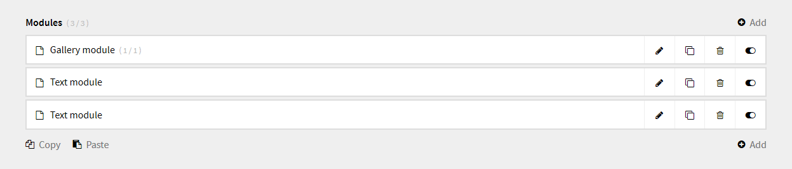
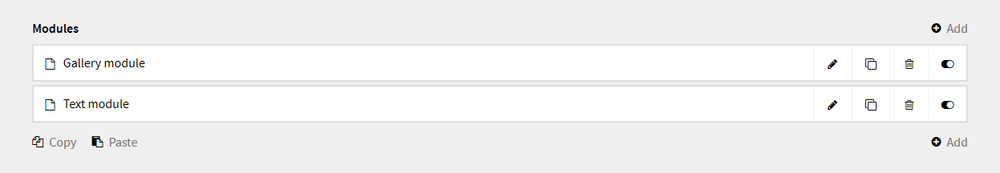
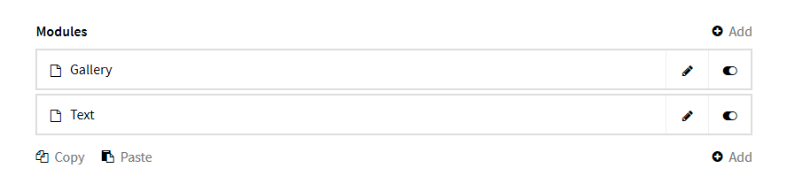
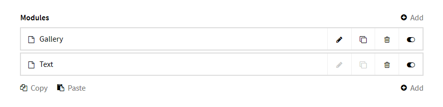

---

### Update from v1.* to v2

With v2 this field is now a plugin and must be installed accordingly.  
[See the installation instructions below](#installation).

---

# Kirby Modules Field

This field was built to extend the [Kirby Modules Plugin](https://github.com/getkirby-plugins/modules-plugin) by providing a more user friendly interface to the plugin.  
In version 2 it is now possible to duplicate modules and copy them across pages.


## Installation

To install the plugin, please put it in the `site/plugins` directory.

```
site/plugins/
    modules-field/
        modules-field.php
        ...
```


## Blueprint

After installing the plugin, you can use the new field type `modules`.  
This blueprint shows all avalable options and their defauts.

```yml
fields:
  title:
    label: Title
    type: text

  modules:
    label: Modules
    type: modules

    add: true
    copy: true
    paste: true
    limit: false
    variant: modules

    actions:
      - edit
      - duplicate
      - delete
      - toggle

    options:
      preview: true
      limit: false
      edit: true
      duplicate: true
      delete: true
      toggle: true
  ...
```

## Examples

The following examples show and explain some of the possible settings.

### Preview

A preview is a normal PHP file with the HTML and PHP code that defines your preview. The preview has access to the following variables:

- `$page`  is the page on which the module appears
- `$module` is the module subpage, which you can use to access the fields from your module blueprint as well as module files
- `$moduleName` is the name of the module such as text or gallery

The preview file must be in the same folder as the module itself.
The module directory looks something like this:

```
site/modules/
    gallery/
        gallery.html.php
        gallery.yml

        #The preview file
        gallery.preview.php
        ...
```

### Preview options

Previews are enabled by default. Set `preview` to `false` to disable the preview.
It is also possible to change the position in the module.

```yml
    options:
      # Render the preview at the bottom
      preview: bottom

      # Or at the top
      # preview: top
      # preview: true
```


### Limit the number of visible modules

```yml
  modules:
    label: Modules
    type: modules

    # Allow 3 visible modules overall
    limit: 3

    # Template specific option
    options:
      module.gallery:
        # Allow only 1 visible gallery module
        limit: 1
```



### Is it a module or a section?

Change the naming.

```yml
    # Modules is fine
    variant: modules

    # Nah sections it is
    variant: sections
```

### Changing actions

To change the actions or remove an action completely from the modules, you must specify the `actions` array in the blueprint.

```yml
    # Default
    actions:
      - edit
      - duplicate
      - delete
      - toggle
```



```yml
    actions:
      - edit
      - toggle
```



### Disabling an action

```yml
    options:
      edit: false
      duplicate: false
      delete: true
      toggle: true

      # Template specific options
      module.gallery:
        edit: true
        duplicate: true
```



## Requirements

- [Kirby](https://getkirby.com/) 2.3+
- [Kirby Modules Plugin](https://github.com/getkirby-plugins/modules-plugin) 1.2+
y
