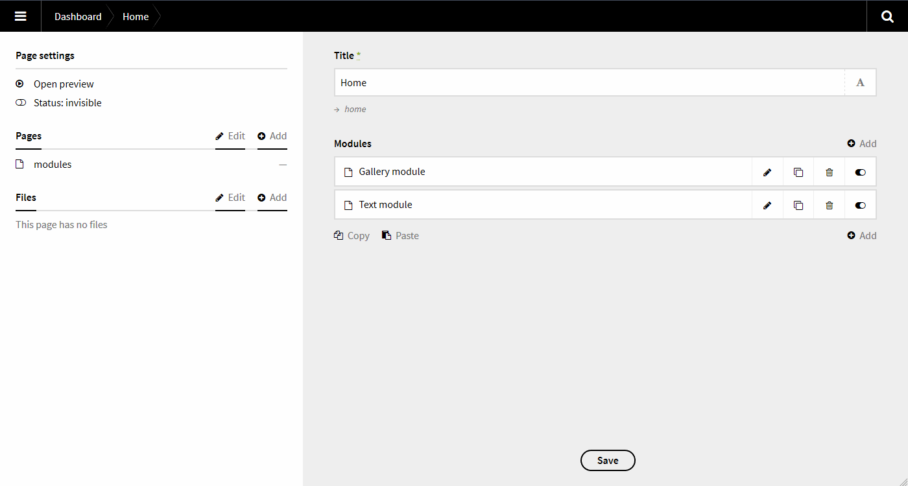

# Kirby Modules Field

This field was built to extend the [Kirby Modules Plugin](https://github.com/getkirby-plugins/modules-plugin) by providing a more user friendly interface to the plugin



## Installation
To install the field, please put it in the `site/fields` directory.

## Blueprints
After installing the custom form field, you can use the new `type` field `modules`.
```yml
fields:
  title:
    label: Title
    type: text
  modules:
    label: Modules
    type: modules
```

### Options
```yml
label: Modules
type: modules
style: items
readonly: false
options:
  redirect: false
  preview: true
  delete: true
  limit: null
  edit: true
```

Option|Default|Description
---|---|---
`style`|`items`|Available styles are `items` and `table`.
`readonly`|`false`|Don't allow changes.
`redirect`|`false`|Determine if the user should get redirected after adding a new module.
`preview`|`true`|The template for this preview must be located inside the modules folder `site/modules/gallery/` and must be named `gallery.preview.php`. The `$module` object is available in the template.
`delete`|`true`|Hide or show the delete button.
`limit`|`null`|Limit how many modules with the same template can be visible.
`edit`|`true`|Hide or show the edit button.

### Template specific options

Add template specific options to override the default options.

```yml
label: Modules
type: modules
options:
  redirect: false
  preview: true
  delete: true
  limit: null
  edit: true

  module.text:
    redirect: true
    preview: false

  module.gallery:
    limit: 1
    edit: false
```

### Max number of modules

To limit the total number of **visible** modules set the `max` option in the subpage settings.

```yml
title: Modules
pages:
  template:
    - module.text
    - module.gallery
  max: 4
```
